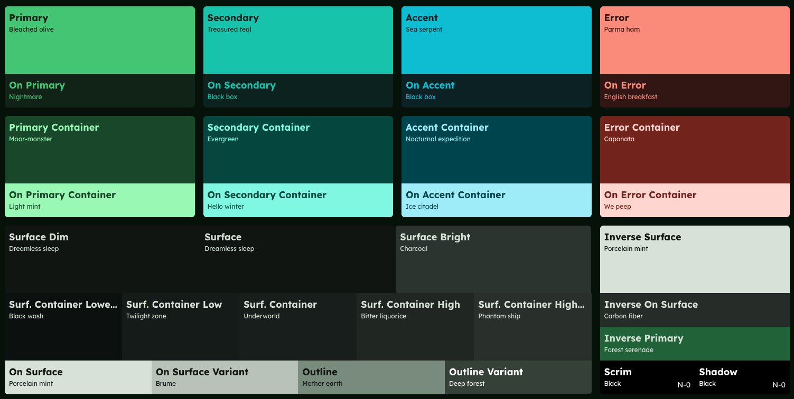
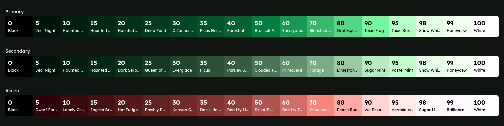
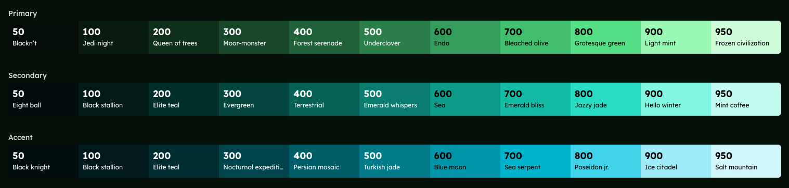
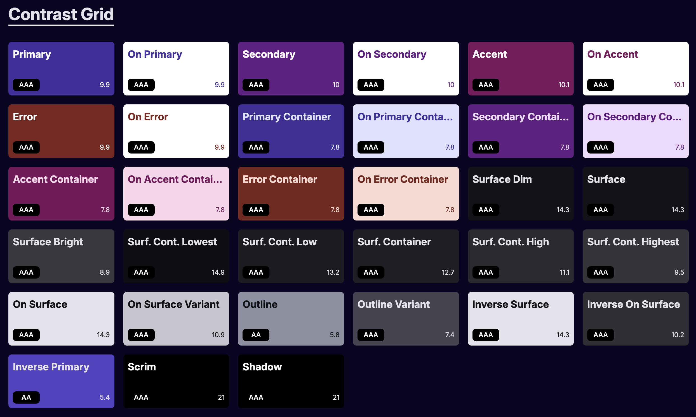

# @palettebro/generator

[![License: MIT][license-image]][license-url]
[![CI][ci-image]][ci-url]
[![NPM version][npm-image]][npm-url]
[![Downloads][downloads-image]][npm-url]

Simple yet powerful color palette generator for your web application based on [Culori](https://culorijs.org/).

## Features

- Easily use advanced color manipulation functions to create harmonious and accessible color palettes
- Automatically generate `light` and `dark` themes
- Use [MUI](https://m3.material.io/) palettes with [Tailwind 4](https://tailwindcss.com/)
- Reverse the scale of `light` and `dark` color shades to drastically reduce the use of `dark:` selectors
- Output palette colors in multiple formats: `rgb`, `hex`, `hsl`, `lch` and `oklch`
- Use the same palette and color tokens across different frontend frameworks

## Purpose

This library automates the generation of a comprehensive color palette given a minimum of one to a maxium of three colors (`primary`, `secondary`, `accent` -a `primary` color is always required). The library generates shades, tones and surface colors most common in modern web design by using color manipulation functions in the `OKHSL`/`OKLCH` color spaces (*)

`primary`, `secondary` and `accent` colors get:

- A set of shades with a range compatible with different frameworks (**)
- Container and foreground tints (`on-primary`, `primary-container`, `on-primary-container`)

Additionally:

- The `primary` color gets a rainbow scale to use in charts
- Various surface and outline colors are generated following [Material UI 3](https://m3.material.io/styles/color/roles) color roles guidelines


(*) Hues are rotated in `OKLCH`, which has more uniform hues than other color spaces. However, instead of using `OKLCH`'s chroma and lightness, it uses saturation and lightness from `OKHSL`, as it is a more human-friendly way of interacting with color. See [Schemist](https://github.com/felixgirault/schemist)

(**) Currently supported Tailwind, Material UI and Bootstap

### Palette


### MUI Shades


### Tailwind Shades


## Modes Of Operation

`@palettebro/generator` works in three different modes or `variants`. Each `variant` has different `presets` that control how `primary`, `secondary` and `accent` colors relate to each other:

- `static`. This variant requires you to specify only a `primary` color. `secondary` and `accent` colors are generated from the `primary` color according to some color wheel manipulation rule specified in the `preset`. For instance, the `triad` preset will choose `secondary` and `accent` colors as equally spaced in the color wheel.
- `mui`. This variant requires you to specify only a `primary` color. `secondary` and `accent` colors are generated from the `primary` color using the [@material/material-color-utilities](https://github.com/material-foundation/material-color-utilities) library. All available `presets` from the library are available, such as `monochrome` or `tonal-spot`
- `dynamic`. This variant accepts up to three colors: `primary`, `secondary` and `accent`. You can generate these colors as you wish, or just input one or two colors if you want a two-colors scheme (like `primary` and `accent`). Use this `variant` to have full control over the generated palette (however you will loose the ability generate harmonious two or three color combinations, as you will have to provide these yourself).

For the full list of `options` refer to [types.ts](src/types/index.ts)

## Theme Presets

### Static Theme Presets

| Preset               | Description |
|----------------------|-------------|
| split-complementary  | Uses split-complementary colors for secondary and accent, creating vibrant contrast. |
| tetrad               | Uses a four-color (tetrad) harmony for secondary and accent, for rich, balanced palettes. |
| triad                | Uses a three-color (triad) harmony for secondary and accent, for dynamic, balanced palettes. |
| hue-shift            | Shifts the hue for secondary (+30°) and accent (+60°), creating harmonious variation. |
| depth                | Adds highlight and shadow shifts for depth and dimensionality. |
| duotone              | Reduces saturation for secondary, highlights for accent, for a soft, two-tone look. |
| neo-brutalist        | Boosts saturation and contrast for bold, high-impact palettes. |
| glassmorphism        | Desaturates secondary, adds highlights/shadows for accent, for a frosted-glass effect. |
| cyberpunk            | Shifts secondary hue (+180°), high contrast for accent, for a neon, futuristic look. |
| vaporwave            | Shifts secondary hue (+195°), pastel highlights for accent, for a dreamy, retro look. |
| retro-futurism       | Boosts secondary saturation, shifts accent hue (+210°), for a playful, nostalgic palette. |
| nordic-minimalism    | Desaturates secondary, cool blue accent, for a clean, minimal look. |
| sunset-gradient      | Warm orange secondary (+35°), magenta accent (+320°), for a sunset-inspired palette. |
| electric-neon        | Maxes out secondary saturation, high contrast or purple/green accent, for neon vibrancy. |
| earth-tones          | Muted secondary, terracotta accent (+50°), for natural, earthy palettes. |
| pastel-dreams        | Light, pastel secondary, lavender accent (+280°), for soft, dreamy palettes. |
| monochrome-depth     | Adjusts lightness and desaturates for monochrome palettes with depth. |

### MUI Theme Presets

| Preset         | Description |
|----------------|-------------|
| content        | Matches the source color closely, with primary container as the seed color and a complementary tertiary. |
| expressive     | Medium chroma, primary hue is intentionally shifted for variety and expressiveness. |
| fidelity       | Maximizes fidelity to the seed color, adjusting tones for accessibility. |
| fruit-salad    | Playful, the source color's hue does not appear in the theme. |
| monochrome     | All colors are grayscale, no chroma. |
| neutral        | Nearly grayscale, with a hint of chroma. |
| rainbow        | Playful, the source color's hue does not appear in the theme. |
| tonal-spot     | Pastel, low chroma palettes; the default Material You theme. |
| vibrant        | Maximizes colorfulness (chroma) in the primary palette. |


## Palette

The `getPalette` function returns an object with the core palette colors:

```ts
const palette = getPalette({
  baseColors: {
    primary: '#007bff',
  },
})

// palette
{
  primary: { name: 'Azure', color: 'oklch(60.48144% 0.216559 257.213551)' },
  secondary: {
    name: 'Lawn green',
    color: 'oklch(60.492921% 0.184386 137.302298)'
  },
  'on-secondary': { name: 'White', color: 'oklch(99.999999% 0 0)' },
  'secondary-container': { name: 'Lima', color: 'oklch(91.408137% 0.188345 137.203108)' },
  'on-secondary-container': {
    name: 'Lincoln green',
    color: 'oklch(39.196261% 0.119129 137.152482)'
  },
  ...
}
```

You can output the color in any of the following formats: `rgb`, `hex`, `hsl`, `lch` and `oklch`

```ts
const palette = getPalette({
  baseColors: {
    primary: '#007bff',
  },
  format: ColorFormatEnum.hex
})

// palette
{
  primary: { name: 'Galactic purple', color: '#412f9c' },
  secondary: { name: 'Evergreen', color: '#19533c' },
  'on-secondary': { name: 'White', color: '#ffffff' },
  'secondary-container': { name: 'Neo mint', color: '#9bface' },
  'on-secondary-container': { name: 'Zucchini', color: '#19513b' },
  'secondary-50': { name: 'Mint coffee', color: '#d0fde7' },
  'secondary-100': { name: 'Neo mint', color: '#9bface' },
  ...
}
```

### Options

The `getPalette` function expects an object with a `theme` property, which should be an object with the following options:

| Option                  | Type      | Description                                                                                      | Default                |
|-------------------------|-----------|--------------------------------------------------------------------------------------------------|------------------------|
| `baseColors.primary`    | `string`  | The primary color (hex). **Required**.                         | —                      |
| `baseColors.secondary`  | `string`  | The secondary color. Optional. If omitted, it is generated from the primary color (except in `dynamic` variant). | —                      |
| `baseColors.accent`     | `string`  | The accent color. Optional. If omitted, it is generated from the primary color (except in `dynamic` variant).   | —                      |
| `format`                | `string`  | Output color format: `rgb`, `hex`, `hsl`, `lch` or `oklch`.                          | `oklch`                  |
| `color-scheme`          | `string`  | Color scheme: `light` or `dark`. Note: a `dark` theme will be automatically generated from a `light` theme and viceversa.                                                                 | `light`                |
| `variant`               | `string`  | Palette generation mode: `static`, `mui`, or `dynamic`.                                          | `static`               |
| `preset`                | `string`  | Preset to use (see tables above for available presets for each variant).                          | `hue-shift` (static)   |
| `reverse`               | `boolean` | Swap the `secondary` and `accent` colors.                                | `false`                |
| `contrast`              | `number`  | Adjusts contrast (currently only available in the `mui` variant).                                                       | `0`                    |
| `reverseLightDarkShades`| `boolean` | Reverse the order of light/dark shades in generated palette.                                      | `true`                 |
| `colorShadesPreset`     | `string`  | Which shade system to use: `tailwind`, `mui`, or `bootstrap`.                                    | `tailwind`             |
| `frameworkCompatibilty` | `string`  | Framework compatibility: `shadcn` or `daisyui`.                                                  | `shadcn`               |

#### Notes

- **Required:** At minimum, you must provide `baseColors.primary`.
- **Secondary/Accent:** If you want full control (e.g., in `dynamic` variant), you can provide `baseColors.secondary` and/or `baseColors.accent`.
- **Preset:** The available values for `preset` depend on the selected `variant` (see the tables above for static and MUI presets).
- **format:** Controls the output color format for all palette entries.

#### Example

```js
const palette = getPalette({
  theme: {
    baseColors: {
      primary: '#007bff',
      secondary: '#ffb300', // optional
      accent: '#e91e63',    // optional
    },
    format: 'oklch',
    'color-scheme': 'dark',
    variant: 'static',
    preset: 'triad',
    reverse: false,
    contrast: 0,
    reverseLightDarkShades: true,
    colorShadesPreset: 'tailwind',
    frameworkCompatibilty: 'shadcn',
  }
});
```

## CSS Variables

The `paletteToCssVars` transforms the core palette colors into CSS variables that can be injected in the DOM or used in your CSS. The function returns an object like:

```ts
const cssVars = paletteToCssVars(palette)

// cssVars
{
  '--color-primary': 'oklch(60.48144% 0.216559 257.213551)',
  '--color-secondary': 'oklch(60.492921% 0.184386 137.302298)',
  '--color-on-secondary': 'oklch(99.999999% 0 0)',
  '--color-secondary-container': 'oklch(91.408137% 0.188345 137.203108)',
  '--color-on-secondary-container': 'oklch(39.196261% 0.119129 137.152482)',
  ...
}
```

You can choose a framework compatibility option to add to the core CSS variables color tokens compatible with a specific framework. Current supported frameworks are:

- [shadcn/ui](https://ui.shadcn.com/)
- [daisyui](https://daisyui.com/)

```ts
const cssVars = paletteToCssVars(palette, FrameworkCompatibilityEnum.daisyui)

// cssVars
{
  ...
  '--color-base-100': 'oklch(98.350639% 0.00791 253.851847)',
  '--color-base-200': 'oklch(98.306083% 0.008026 278.639769)',
  '--color-base-300': 'oklch(96.656192% 0.015669 266.279586)',
  '--color-base-content': 'oklch(17.860627% 0.062743 256.740222)',
  '--color-primary-content': 'oklch(99.999999% 0 0)',
  '--color-secondary-content': 'oklch(99.999999% 0 0)',
  ...
}
```

## Accessibility (Contrast)

You can verify the accessibility of color pairs against `WCAG2` and `WCAG3` (APAC) guidelines thanks to the [apca-w3](https://www.npmjs.com/package/apca-w3) library.

- To get the `WCAG2` or `WCAG3` contrast value of a color pair use `wcag2Contrast` or `wcag3Contrast`
- To get the `WCAG2` or `WCAG3`grade of a color pair use `wcag2ContrastGrade` or `wcag3ContrastGrade`
- To check the readability of a color pair, use `isWcag2Readable` or `isWcag3Readable`

See [Demo](../../apps/demo-nodejs/src/index.ts) for example usage.



## Installation

```bash
npm install @palettebro/generator
# or
yarn add @palettebro/generator
```

## Usage

See [Demo](../../apps/demo-nodejs/README.md)

## Libraries Used

- [Culori](https://culorijs.org/): A comprehensive color library for JavaScript, used for color conversions, manipulations, and calculations.
- [@material/material-color-utilities](https://github.com/material-foundation/material-color-utilities): Utilities for Material Design color systems, including tonal palettes and dynamic color schemes.
- [apca-w3](https://www.npmjs.com/package/apca-w3): Implements the APCA (Advanced Perceptual Contrast Algorithm) for accessible color contrast calculations.
- [delta-e](https://www.npmjs.com/package/delta-e): Provides Delta E color difference formulas for measuring perceptual differences between colors.
- [nearest-color](https://www.npmjs.com/package/nearest-color): Finds the closest named color to a given color value.
- [valibot](https://github.com/fabian-hiller/valibot): Type-safe data validation

## Note About Color Names

Color names are assigned by finding the closest match to a given color using the [nearest-color](https://www.npmjs.com/package/nearest-color) library. The matching is performed against [this](https://github.com/meodai/color-names) list of color names and their corresponding hex values, which aims to provide meaningful and recognizable names for a wide range of colors. If no close match is found, the original hex value is used as the name.

🚨 The color names list adds `~105KB` to the base bundle size of `~32KB`

## License

MIT

[license-image]: https://img.shields.io/badge/License-MIT-brightgreen.svg?style=flat-square
[license-url]: https://opensource.org/licenses/MIT
[ci-image]: https://img.shields.io/github/actions/workflow/status/matteolc/-palettebro/ci.yml?branch=main&logo=github&style=flat-square
[ci-url]: https://github.com/matteolc/-palettebro/actions/workflows/ci.yml
[npm-image]: https://img.shields.io/npm/v/@palettebro%2Fgenerator.svg?style=flat-square
[npm-url]: https://npmjs.org/package/@palettebro%2Fgenerator
[downloads-image]: https://img.shields.io/npm/dm/@palettebro%2Fgenerator.svg?style=flat-square